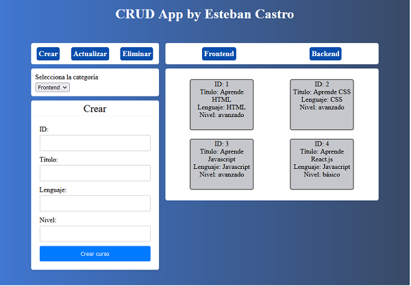

# Backend development with Node.js and Express.js

This repository contains some excersices, concepts and mini-projects to practice backend development with Node.js modules, API development and CRUD operations with Express.js

## Key concepts and proyects

* Package creation and configuration.
* Synchronous and Asynchronous code execution mini-proyect.
* Node server proyect using Node.js native modules (Quotes App).
* CRUD App with Node.js and Express.js.

## Features CRUD App with Express.js

This is a Full Stack app developed with HTML, CSS, JavaScript, Node.js & Express.js, including
some of the next features:

* Advanced JS logic in the client to handle get, post, put and delete requests to the backend.
* UI structuring and designing with HTML and CSS.
* Dinamic content creation with JavaScript.
* Backend and API Restful development with Node.js and Express.js.
* Data validation methods in the frontend and backend (express-validator).

